# SBB-Neo4j-AuraDB-Agent-Hackathon-Life-Pulse

This repository is part of the **Neo4j AuraDB Agent Hackathon**. It uses a Kaggle dataset on life expectancy and health spending covering the period from **1960 to today**, sourced from the World Bank Open Data, the World Health Organization (WHO) Global Health Observatory, and OECD Health Statistics.

---

## 🤖 Agent Name

**Aura-Health-Bot**

---

## 💡 What It Does

**Aura-Health-Bot** is an intelligent conversational agent powered by Neo4j AuraDB. It loads global health data spanning from **1960 to the present day** (with periodic refreshes as new data becomes available), drawing from three authoritative sources:

- 🌍 **World Bank Open Data** — macroeconomic indicators, healthcare expenditure, and population statistics.
- 🏥 **World Health Organization (WHO) Global Health Observatory** — disease burden, mortality rates, life expectancy, and health system performance metrics.
- 📊 **OECD Health Statistics** — detailed health spending, workforce, and outcomes data for OECD member countries.

The agent is designed to serve a wide range of users, including:

| User Group | Use Case |
|---|---|
| **Healthcare Professionals** | Benchmark health outcomes and spending across countries and years |
| **Scientists & Researchers** | Explore longitudinal trends in longevity, disease, and investment |
| **Policymakers** | Evaluate the return on investment of healthcare expenditure |
| **Students & Educators** | Visualize six decades of global health data interactively |
| **General Public** | Ask plain-language questions and receive fast, accurate answers |

Users can ask questions in natural language such as:
- *"Which countries have the highest life expectancy relative to their healthcare spending?"*
- *"How has life expectancy changed in Sub-Saharan Africa since 1980?"*
- *"What is the average health expenditure per capita in OECD countries over the last decade?"*

The bot translates these questions into graph traversals across Neo4j AuraDB, returning accurate, contextual answers quickly and efficiently.

---

## 🗃️ Dataset and Why a Graph Fits

### About the Dataset

#### Context

Does higher spending always lead to a longer life? This dataset explores the complex relationship between **national healthcare expenditure** and **life expectancy**. Spanning over **six decades** (1960 to today — more than 65 years of data), it allows for a deep dive into how medical advancements, economic shifts, and policy changes have influenced human longevity across different continents and income levels.

#### Sources

The data is aggregated from major global repositories:

- **World Bank Open Data** — [https://data.worldbank.org](https://data.worldbank.org)
- **WHO Global Health Observatory** — [https://www.who.int/data/gho](https://www.who.int/data/gho)
- **OECD Health Statistics** — [https://www.oecd.org/health/health-data.htm](https://www.oecd.org/health/health-data.htm)

#### Inspiration

This dataset was compiled to help researchers and students visualize the **"Return on Investment" in healthcare**. It serves as a foundation for analyzing why some nations achieve high longevity with modest budgets, while others spend significantly more for similar or lesser results.

---

### Why a Graph Database Fits This Dataset

A **graph database like Neo4j AuraDB** is an ideal fit for this dataset for several reasons:

1. **Highly Connected Data**: The dataset involves deeply interconnected entities — countries, regions, income groups, years, health metrics, and expenditure figures. These natural relationships are cumbersome to model in relational tables but are first-class citizens in a graph.

2. **Traversal-Heavy Queries**: Questions like *"Find all low-income countries where life expectancy increased despite low healthcare spending"* require multi-hop traversals across time, geography, and economic groupings — operations that graph databases handle natively and efficiently.

3. **Temporal Patterns**: Tracking how a country's health metrics evolve over 60+ years is naturally represented as a chain of time-linked nodes, enabling intuitive time-series analysis without complex SQL date joins.

4. **Comparative Analysis**: Comparing countries within the same income group, continent, or WHO region is straightforward using graph relationships rather than repeated JOIN operations.

5. **Flexible Schema**: As new data sources or metrics are added (e.g., pandemic indicators, mental health data), the schema-optional nature of Neo4j allows seamless extension without costly migrations.

6. **AI/Agent Integration**: Neo4j AuraDB's vector index and graph traversal capabilities make it easy to build LLM-powered agents that can answer complex, contextual queries over the health data with high accuracy.

**Graph Model:**

### Nodes

| Node | Description |
|------|-------------|
| `(:Country)` | A sovereign nation, identified by its name and ISO country code. Acts as the central anchor connecting geography, economy, and health data. |
| `(:Region)` | A World Bank geographic region (e.g. *South Asia*, *Sub-Saharan Africa*). Groups countries by geography for regional comparisons. |
| `(:IncomeGroup)` | A World Bank income classification (e.g. *High income*, *Low income*). Enables socioeconomic benchmarking across countries. |
| `(:Snapshot)` | A country–year observation record. The hub node connecting all metric nodes for a specific country and year. Also holds a `contextText` field — a rich paragraph summarising all metrics for that year, used for vector similarity search. |
| `(:LifeExpectancy)` | Life expectancy at birth (total, female, male), gender gap, and year-on-year change for a given country–year. |
| `(:HealthSpending)` | National health expenditure as % of GDP and per capita (USD), spend tier classification, and year-on-year changes. |
| `(:HospitalCapacity)` | Healthcare workforce and infrastructure density — hospital beds, physicians, and nurses/midwives per 1,000 population, plus a capacity tier. |
| `(:InfantMortality)` | Child and maternal mortality rates — infant, under-5, and maternal mortality with year-on-year improvement tracking and burden tier. |
| `(:EconomicContext)` | Macroeconomic indicators — GDP per capita (USD), total population, log-GDP, year-on-year GDP growth, and income tier. |
| `(:EfficiencyMetrics)` | Health system efficiency scores — life expectancy gained per GDP point, per $1k of health spend, spend residual, and a composite efficiency score. |

### Relationships

```
(:Country)-[:IN_REGION]->(:Region)
(:Country)-[:IN_INCOME_GROUP]->(:IncomeGroup)
(:Country)-[:HAS_SNAPSHOT]->(:Snapshot)
(:Snapshot)-[:NEXT_YEAR]->(:Snapshot)
(:Snapshot)-[:HAS_LIFE_EXPECTANCY]->(:LifeExpectancy)
(:Snapshot)-[:HAS_SPENDING]->(:HealthSpending)
(:Snapshot)-[:HAS_CAPACITY]->(:HospitalCapacity)
(:Snapshot)-[:HAS_MORTALITY]->(:InfantMortality)
(:Snapshot)-[:HAS_ECONOMY]->(:EconomicContext)
(:Snapshot)-[:HAS_EFFICIENCY]->(:EfficiencyMetrics)
```

This model allows Aura-Health-Bot to answer questions by traversing relationships between countries, their health indicators, time periods, and data provenance — something a flat table structure simply cannot do as elegantly.

---

## 📸 Screenshots

### Agent in the Aura Console

#### Cypher Template Tool — Configuration
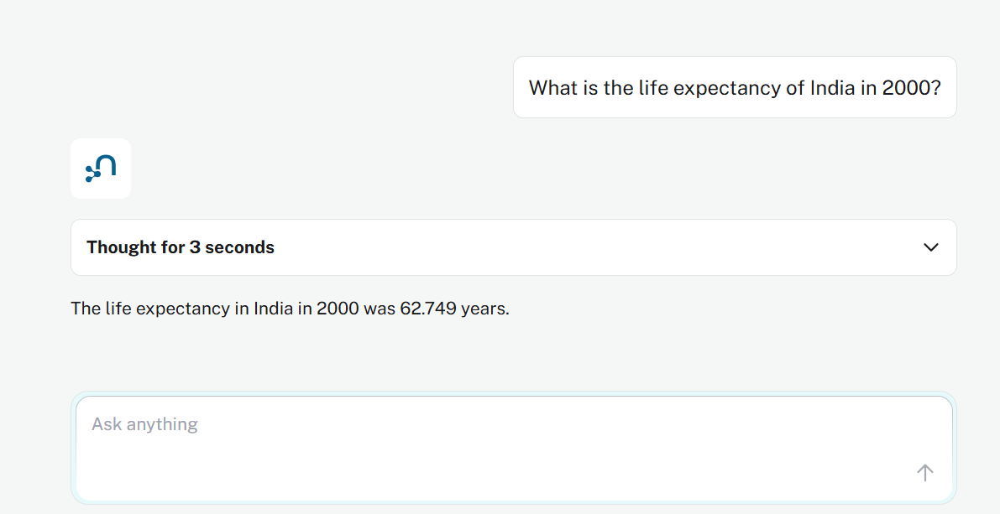
*Cypher Template tool set up inside the Neo4j Aura Agent console, ready to execute pre-defined parameterised queries.*

#### Cypher Template Tool — In Use
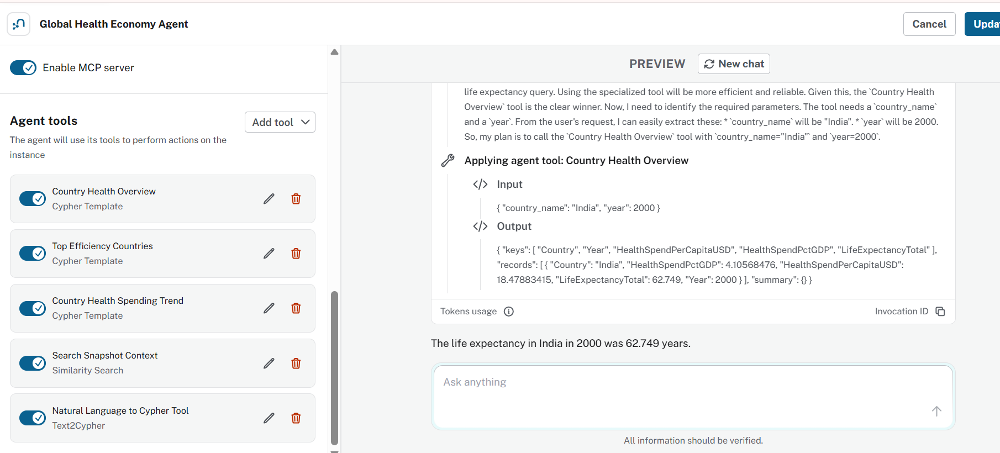
*Agent invoking the Cypher Template tool to retrieve structured health metrics for a specific country and year.*

#### Text2Cypher Tool — In Use (Page 1)
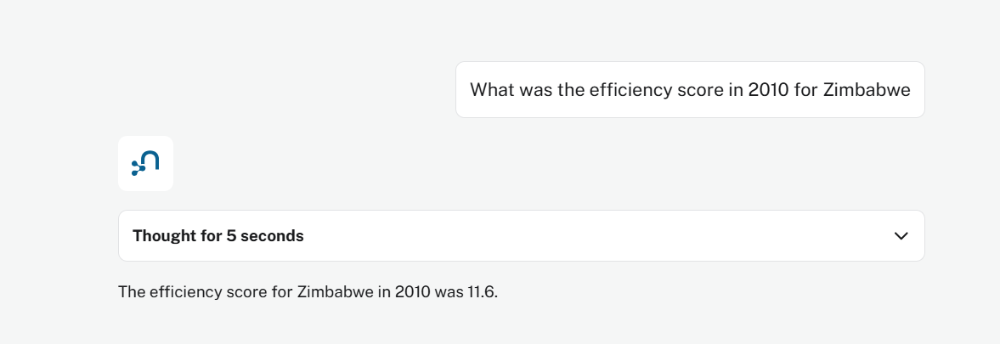
*Agent using the Text2Cypher tool to translate a natural language question into a Cypher query and traverse the graph.*

#### Text2Cypher Tool — In Use (Page 2)
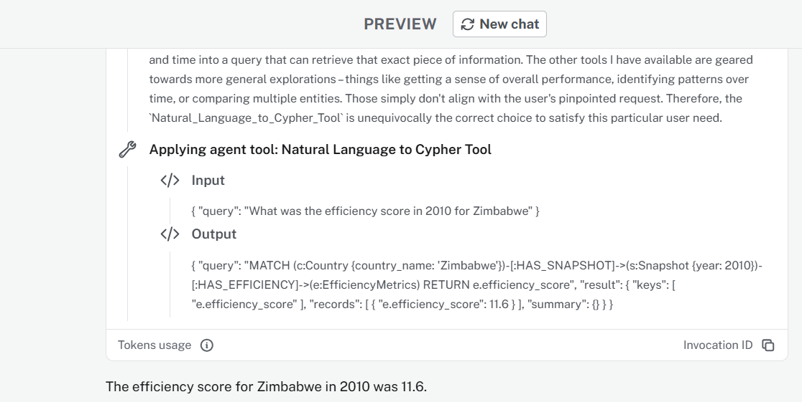
*Query results returned from Neo4j AuraDB and surfaced as a plain-language answer.*

#### Similarity Search Tool — In Use (Page 1)
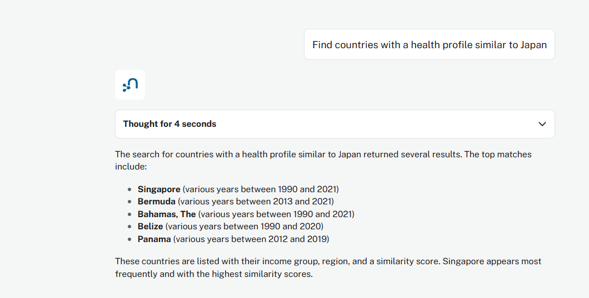
*Agent performing a vector similarity search to find countries with a comparable health profile.*

#### Similarity Search Tool — In Use (Page 2)
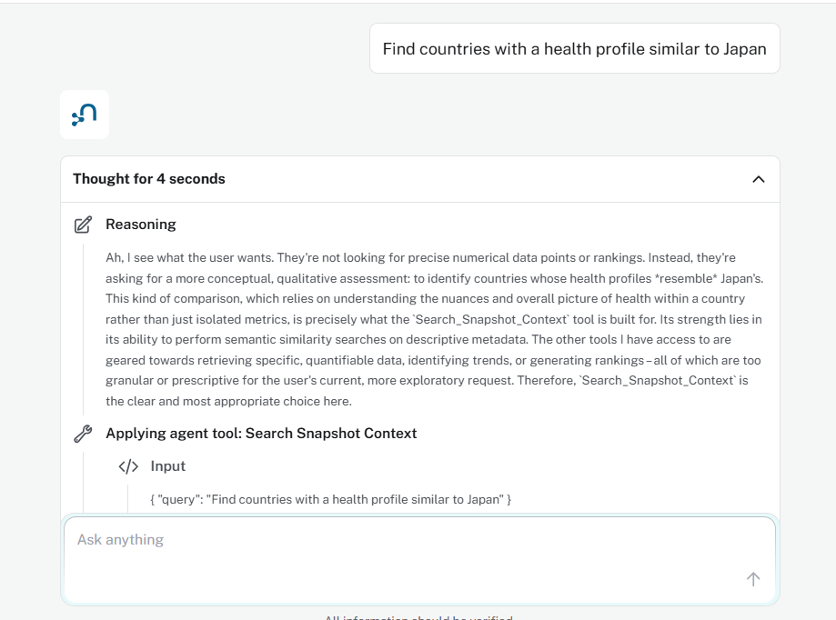
*Matched countries ranked by similarity score, with key health indicators compared.*

### Agent in Action (Demo)

> *(A full demo video will be attached here once available.)*

---

### 🗺️ AuraDB Explorer & Bloom Visualisation

#### AuraDB Graph Explorer
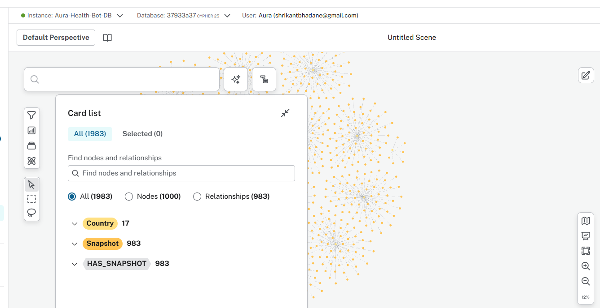
*Graph Explorer view of the Life Pulse knowledge graph — countries, snapshots and health metric nodes rendered as an interactive network.*

#### Bloom Graph Visualisation

*Neo4j Bloom perspective highlighting relationships between countries, regions, income groups and annual health snapshots.*

---

### 📊 Dashboard Views

#### Dashboard — Page 1
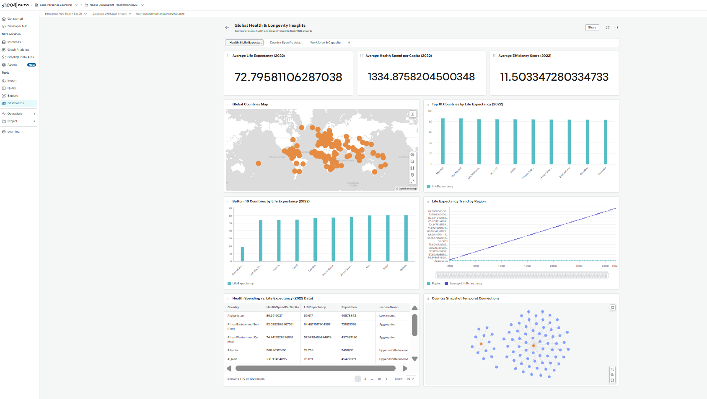
*Executive overview: global life expectancy, health spend and mortality KPIs at a glance.*

#### Dashboard — Page 2
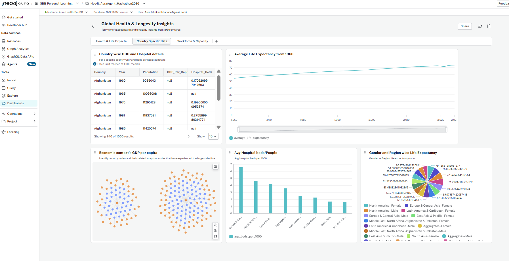
*Trend analysis: regional and income-group comparisons across decades.*

#### Dashboard — Page 3
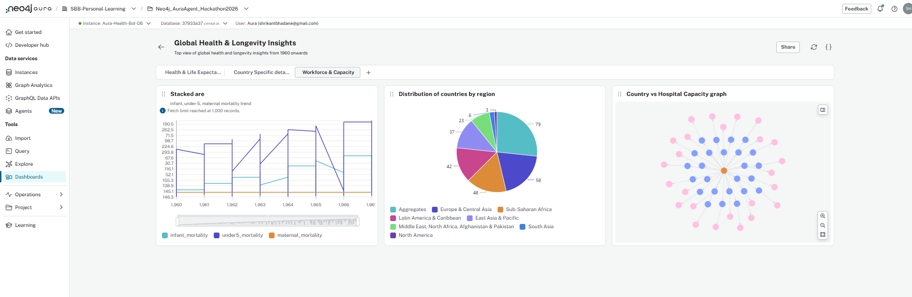
*Efficiency and equity view: health system performance relative to spending and GDP.*

---

### 🔵 Nodes, Relationships & Properties

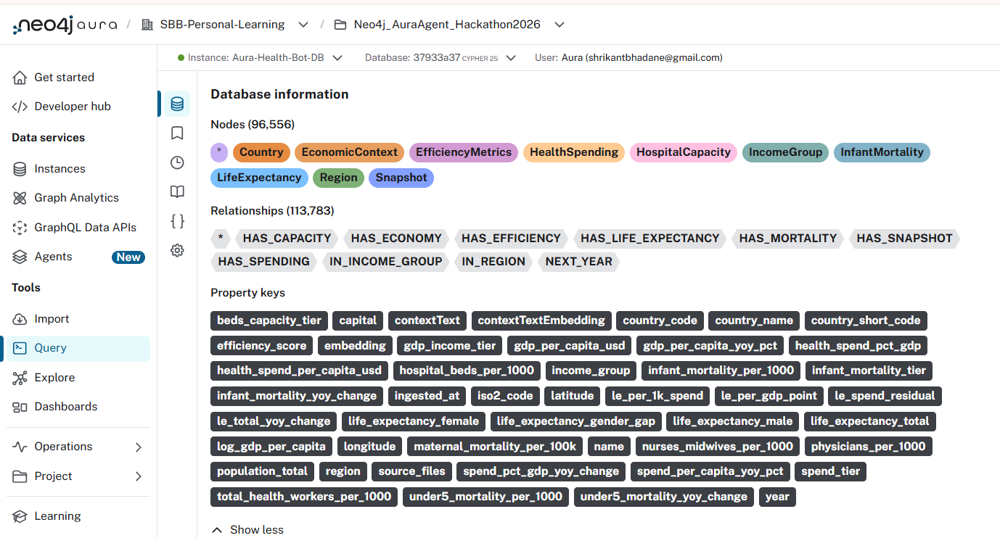
*Full schema view showing all 10 node labels, their relationships and key properties as modelled in Neo4j AuraDB.*

---

## 🔗 Agent Link

> *(Link to the live agent will be shared here once available.)*

## 🖥️ MCP Server Link

> [Connect via MCP](https://mcp.neo4j.io/agent?project_id=d0b38bd0-7dc4-4136-9d36-a8a863db33ea&agent_id=21b70856-0c04-4e62-9383-681f9cc0cb66)

---

## 📁 Repository Structure

```
SBB-Neo4j-AuraDB-Agent-Hackathon-Life-Pulse/
├── app.py                        # Streamlit web application (Life Pulse UI)
├── README.md                     # Project documentation (this file)
├── requirements.txt              # Python dependencies
├── .gitignore                    # Git ignore rules
├── .streamlit/
│   └── secrets.toml              # API credentials 
└── data/
    ├── life_expectancy.csv       # Life expectancy at birth by country & year
    ├── health_spending.csv       # Health expenditure % GDP & per capita USD
    ├── hospital_capacity.csv     # Hospital beds, physicians & nurses per 1,000
    ├── infant_mortality.csv      # Infant, under-5 & maternal mortality rates
    ├── context.csv               # GDP per capita, population & economic context
    ├── country_metadata.csv      # ISO codes, World Bank region, income group, lat/lon
    ├── health_panel.csv          # All indicators merged (primary analysis file)
    └── File-Columns.txt          # Column reference guide for all datasets
```

---

## 🏆 Hackathon Submission

This project is submitted as part of the **Neo4j AuraDB Agent Hackathon**. The goal is to demonstrate how Neo4j AuraDB, combined with an AI-powered agent, can unlock insights from complex, highly connected health and economic datasets. The dataset referred from kaggle in public domain, please don't use for any production purpose. This project is only for study and learning purpose of neo4j AuraDB Agent capability and not for any financial purpose.

